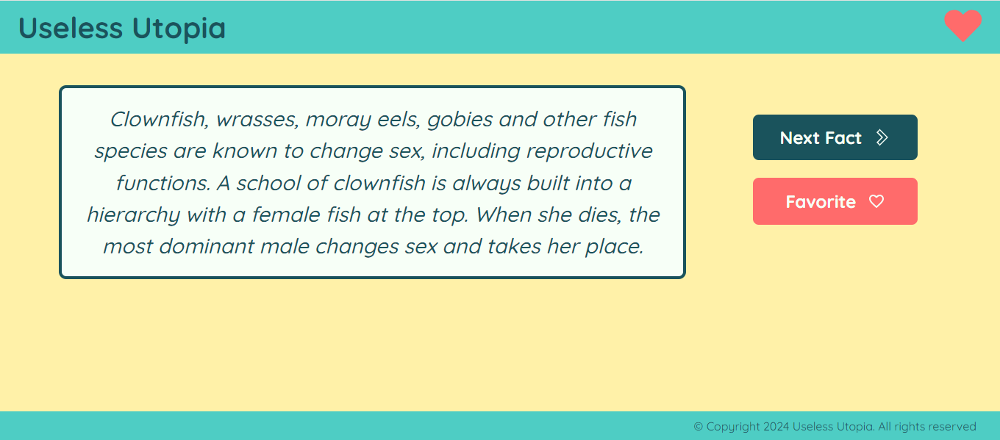
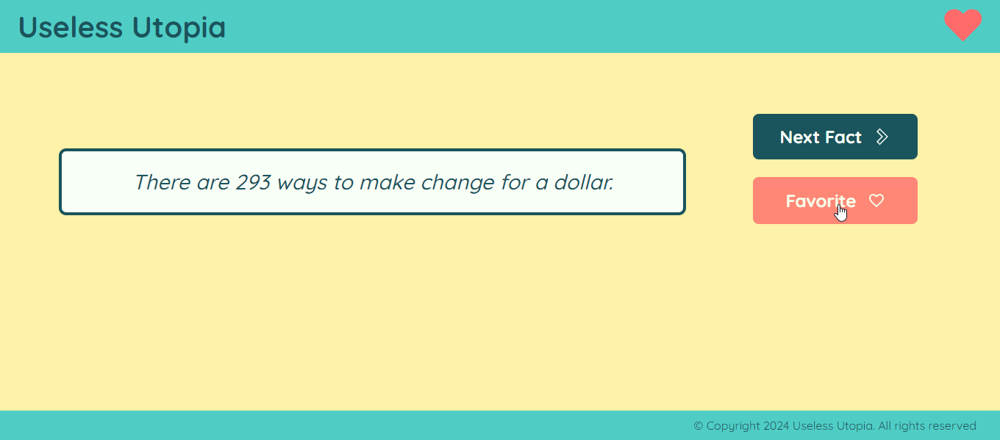
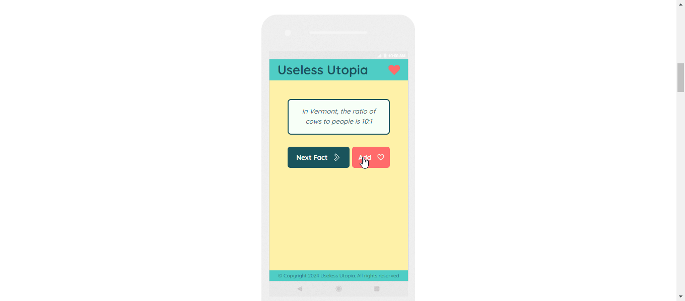
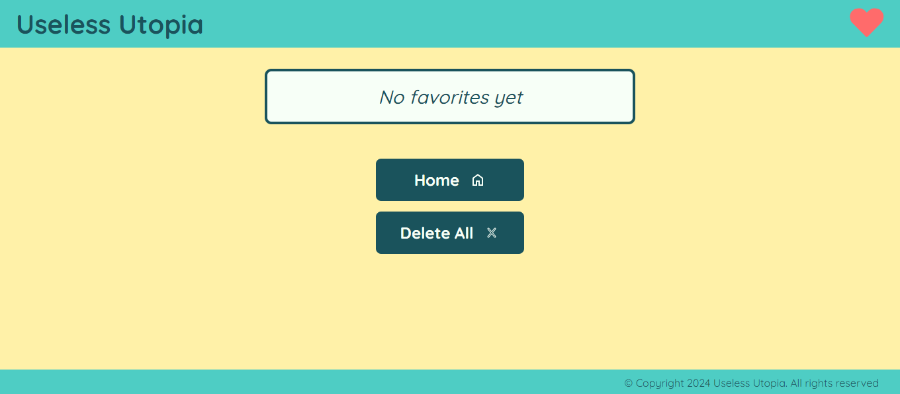
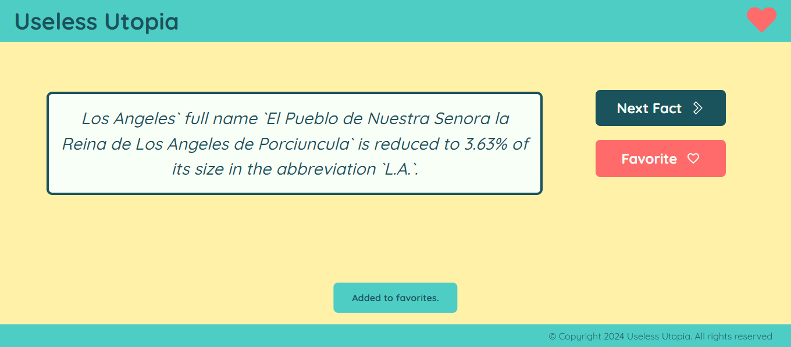
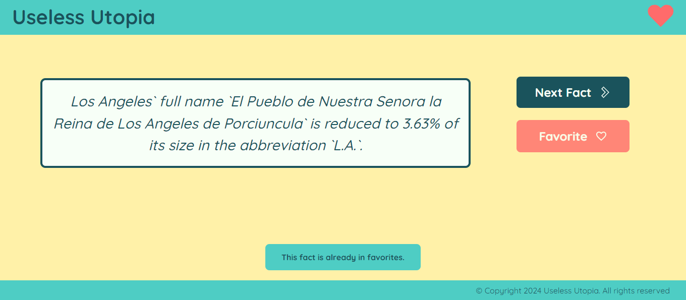

# Useless Utopia

Useless fact generator that operates as a single-page application (SPA), allowing users to view and save their favorite facts. 



## Table of Contents

- [Overview](#overview)
  - [Requirements](#requirements)
  - [Demo Videos and Images](#demo-videos-and-images)
  - [Link](#link)
  - [Testing](#testing)
  - [Installation](#installation)

- [The process](#the-process)
  - [Technologies](#technologies)
  - [Features](#features)
  - [Project Updates](#project-updates)
  - [Authors](#authors)

## Overview

### Requirements

Develop a useless fact generator using the facts returned by the API https://uselessfacts.jsph.pl/, ensuring that you fulfill the following requirements:

#### Functional Requirements:
- The application must call each fun fact one by one
- The application must display the called fun fact
- The application must stop displaying the fun fact when a new one is called
- The application must allow users to add fun facts to a favorites list
- The application must be mobile first
- The application must be responsive for at least two breakpoints
- The application must be a single page application (SPA), meaning there will only be a single HTML file

#### Non-Functional Requirements (Quality Attributes)
- The application should have a coherent folder structure
- The application should use good naming conventions for classes, ids, functions, etc.
- The design of the application is free
- The project must use Gitflow and branch-based workflows
- The application must contain unit tests using any library (Vitest, Jest, Cypress, Jasmine, Mocha, Chai, etc.)

### Demo Videos and Images

Desktop demo video:



Mobile demo video:



Screenshot showing an empty favorites section:



Screenshot showing the toast message that appears when adding a favorite:



Screenshot showing the toast message that appears when trying to add the same favorite again:



### Link 

- Live site URL: [Useless Utopia](https://useless-utopia.vercel.app/)


### Testing

This project includes unit and integration tests to ensure the functionality of core features. The tests are written using Vitest, a fast and lightweight testing framework, along with JSDOM for simulating a DOM environment. All tests passed. Here is an overview:

#### Index Tests (index.js)
- Purpose: Validate the presence of essential HTML elements and resources.
- Tests Include:
  - Ensuring the CSS file is correctly linked.
  - Verifying that scripts are properly included in the HTML.

#### Data Tests (data.js)
- Purpose: Verify the correct behavior of the get_fact function, which fetches random facts from an API.
- Tests Include:
  - Mocking successful API responses to ensure the function returns the expected fact text.
  - Handling unsuccessful API responses to ensure proper error handling.

#### Favorites Tests (favorites.js)
- Purpose: Ensure the favorites functionality is correctly implemented.
- Tests Include:
  - Checking the existence and type of key functions (add_favorite, list_favorites).
  - Setting up the DOM environment using JSDOM for testing interactions with HTML elements.

#### Running the Tests
To run the tests, use the following command:

```bash
npm test  
```   

### Installation 

To install this project, clone or fork the repository https://github.com/lolamindi/useless-utopia 


## The Process 

### Technologies

The following technologies and versions were used in this project:

- **HTML5**: Structuring the content of the web application
- **CSS3 (vanilla)**: Styling the web application
- **JavaScript (vanilla)**: Adding interactivity to the web application
- **Node.js v20.9.0**: Server-side scripting and development tasks
- **Vitest v1.0.4**: Testing framework used for unit and integration tests
- **Vite v5.0.10**: Build tool for the project, facilitating fast development and production 
- **JSDom v23.0.1**: Used for simulating a DOM environment in tests

### Features 

- CSS variables 
- Flexbox
- Organisation by components 
- DOM manipulation
- Facts saved to local storage
- Mobile-first workflow
- Unit tests and integration tests
- Toast alert messages

### Project Updates 

When originally submitted in December 2023, this project included the following issues:
- The first fact that appears on the home screen was hardcoded into the HTML
- It was possible to delete all favorite facts but not to delete individual facts

Following project updates, complete in May 2024:
- The initial fact is now dynamically fetched from the API and displayed when the page loads, ensuring a fresh and unique fact each time the application is accessed:

```javascript
document.addEventListener("DOMContentLoaded", () => {
  index();
  new_fact();
});
```

- There is now an X button that appears in the bottom right corner of every favorite fact that is added dynamically and styled with CSS. This allows users to delete facts one-by-one from their favorites section:

```javascript
const individual_delete_button = document.createElement("button");
      individual_delete_button.innerHTML = "X";
      individual_delete_button.classList.add("individual_delete_button");

      individual_delete_button.addEventListener("click", () => {
        favorites_list.splice(index, 1);
        localStorage.setItem("favorites", JSON.stringify(favorites_list));
        favorites(); 
      });

      list_item.appendChild(individual_delete_button);
      favorites_list_elem.appendChild(list_item);
    });
  }
  ```

  ### Authors

  - [Laura Artaza](https://github.com/lolamindi)
  - [Daniella Cardona](https://github.com/dani-cp)
  - [Gabriela Peralta](https://github.com/jfpaes6453) 
  - [Aleksandra Vertiankina](https://github.com/kametazin)
